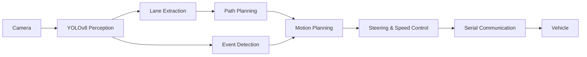

<div align="center">

# 🚗 H-Mobility Class Autonomous Driving
### 2026 자율주행 심화과정 · Team 7 Final Project

**Camera-based Perception · Lane Planning · Event-driven Decision Making · Vehicle Control**


</div>

---

## Overview

H-Mobility Class 자율주행 심화과정의 최종평가를 위해 구현한 **ROS 2 기반 소형 자율주행 차량 시스템**입니다.

카메라 영상으로부터 YOLO 기반 차선·이벤트 정보를 인식하고, 차선 중심 경로를 생성한 뒤 조향 및 속도 명령을 계산하여 차량을 주행시킵니다. 별도의 LiDAR 기반 판단에 의존하지 않고, 카메라 인식 결과를 이용해 **차선 추종, 신호 대응, 장애물 구간 통과 및 최종 정지**까지 하나의 파이프라인으로 구성했습니다.



---

## Driving Demo

https://github.com/user-attachments/assets/c31f68aa-fa91-4740-bb26-dfd4248b6e04

<div align="center">
  <sub>Team 7 autonomous driving test</sub>
</div>

---

## Perception

### YOLO-based Lane Detection

YOLO segmentation을 통해 주행 차선을 검출하고, 검출된 `lane2` 마스크를 Bird's-eye view 및 ROI 기반으로 후처리하여 경로 생성에 사용합니다.

<div align="center">
  
  <br>
  <sub>YOLO segmentation 기반 차선 검출 및 주행 경로 시각화</sub>
</div>

<br>

### Event Detection & Stop Trigger

`red`, `green`, `obstacle` 등의 검출 결과를 이용해 이벤트 기반 상태 전이를 수행합니다. 순간적인 검출 손실에 바로 반응하지 않도록 hold logic을 적용하고, 장애물 통과 및 녹색 표식 검출 조건을 이용해 최종 정지 시퀀스를 구성했습니다.

<div align="center">
  
  <br>
  <sub>YOLO detection을 이용한 이벤트 판단 및 정지 트리거</sub>
</div>

---

## Key Algorithms

### 1. Lane Center & Path Generation

- YOLO segmentation 결과에서 주행 차선 마스크 추출
- Bird's-eye view 변환 및 하단 ROI를 이용한 원근 왜곡 영향 감소
- 여러 높이에서 좌·우 차선 픽셀을 탐색하여 차선 중심점 계산
- 한쪽 차선만 검출되는 경우 차선 폭과 도로 기울기를 이용해 중심점 보정
- 복수의 중심점을 **Natural Cubic Spline**으로 보간하여 부드러운 주행 경로 생성

### 2. Steering Control

생성된 경로의 기울기를 조향 오차로 사용하며, **PID steering control**을 적용했습니다. 미분항의 영상 노이즈 민감도를 줄이기 위해 **2차 Butterworth Low-pass Filter**를 적용하고, 실제 차량의 조향 범위에 맞게 steering command를 제한했습니다.

### 3. Event-driven Decision Making

기본 상태에서는 차선을 추종하며 YOLO 검출 결과에 따라 주행 상태를 전환합니다.

| Detection | Behavior |
|---|---|
| `lane2` | Lane following |
| `red` | Stop & hold |
| `obstacle` | Obstacle-event sequence |
| `green` | Deceleration / final stop trigger |

### 4. Vehicle Command

목표 속도 명령에 smoothing을 적용하여 급격한 motor command 변화를 줄이고, 최종 steering/speed command를 ROS 2 topic을 통해 전달한 뒤 serial communication node에서 차량 제어기로 전송합니다.

---

## ROS 2 Architecture

주요 실행 흐름은 `auto_driving.launch.py`에 통합되어 있습니다.

```text
camera_perception_pkg
 ├─ image_publisher_node
 ├─ yolov8_node
 ├─ lane_info_extractor_node
 └─ traffic_light_detector_node
          │
          ▼
decision_making_pkg
 ├─ path_planner_node
 └─ motion_planner_node
          │
          ▼
launch_pkg / auto_drive_control
          │
          ▼
serial_communication_pkg
 └─ serial_sender_node
          │
          ▼
       Vehicle
```

### Main Packages

| Package | Role |
|---|---|
| `camera_perception_pkg` | Camera input, YOLO inference, lane/event extraction |
| `decision_making_pkg` | Path generation and motion decision |
| `control` | Vehicle control utilities |
| `serial_communication_pkg` | Vehicle command transmission |
| `debug_pkg` | Detection / image visualization |
| `launch_pkg` | Integrated ROS 2 launch configuration |
| `skk_assign` | Model and course assignment resources |

---

## Run

### 1. Clone Team 7 branch

```bash
git clone -b team-7 --recursive https://github.com/SEOSUK/H-Mobility-Autonomous-Advanced-Course.git
cd H-Mobility-Autonomous-Advanced-Course
```

### 2. Install dependencies

```bash
bash install.sh
```

### 3. Build

```bash
source /opt/ros/humble/setup.bash
colcon build --symlink-install
source install/setup.bash
```

### 4. Launch autonomous driving pipeline

```bash
ros2 launch launch_pkg auto_driving.launch.py
```

> Camera device, YOLO model/device, visualization window, perception/planning/control nodes can be enabled or configured through launch arguments.

---

## Project Notes

구현 과정, 최종평가 기록, 알고리즘 세부 설명 및 튜닝 내용은 아래 Notion 페이지에 정리했습니다.

### 📘 [H-Mobility Class · Team 7 Project Notes](https://app.notion.com/p/08-17-1-3d732dc77e4c805aa08bdea103ec40bf)

---

## Highlights

- ROS 2 기반 **Perception → Planning → Control** end-to-end pipeline 구성
- YOLO segmentation 기반 차선 인식 및 주행 경로 생성
- Natural Cubic Spline 기반 부드러운 lane-center path 생성
- PID steering + Butterworth LPF 기반 조향 안정화
- 카메라 검출만을 활용한 event-driven decision logic 구현
- Red-light hold, obstacle pass, green-triggered final stop sequence 구현
- 실차 주행 데이터 확보를 위한 주기적 camera frame logging 기능 구현

---

## Acknowledgement

This repository is based on the **H-Mobility Class Autonomous Driving Advanced Course** materials provided by SKKU Automation Lab and was extended for the **Team 7 final project**.

본 저장소의 원 교육용 코드 및 자료에 대한 저작권과 출처는 원 저작자에게 있으며, 프로젝트 구현 내용은 교육 및 연구 목적으로 정리했습니다.

## License

This repository follows the original project's [GPL-3.0 License](LICENSE).
